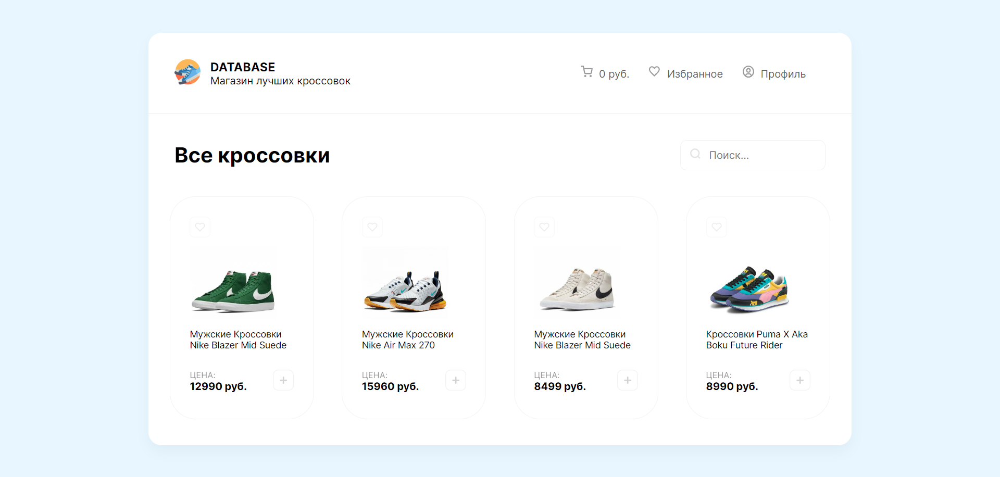
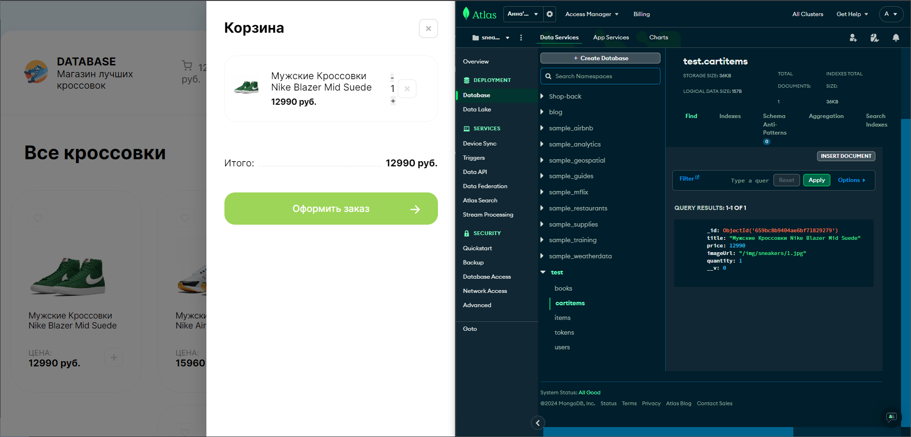
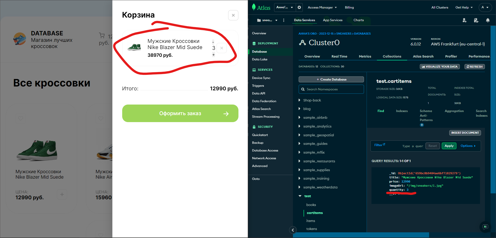
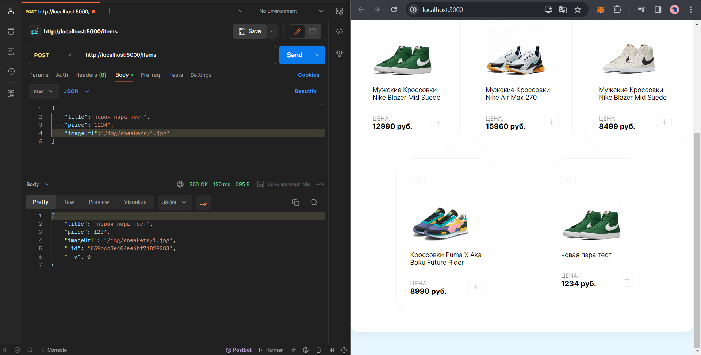

Для запуска самого приложения необходимо запустить 2 проекта 
Для запуска back в терминале пишем команду `npm run dev`
Для запуска react-sneakers в терминале пишем команду `npm start`

После запука откроется главное окно 

при нажатии конпки добавить, в бд записываются данные о добавленном товаре и отображаются в корзине 

при нажатии кноки увеличения и уменьшения количества, изменяется данное значение в бд и отображается обновленная информация о стоимости товара 

для добавления данных в бд посылаются запросы с postman

если при добавлении товара в корзину, цена будет NaN, надо обновить страницу и тогда отображаться будет как надо 