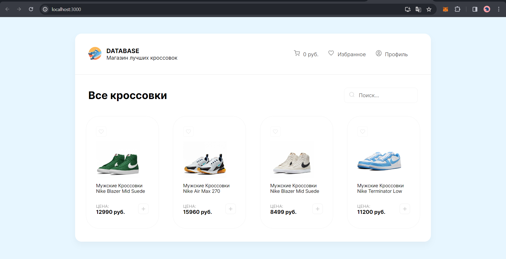
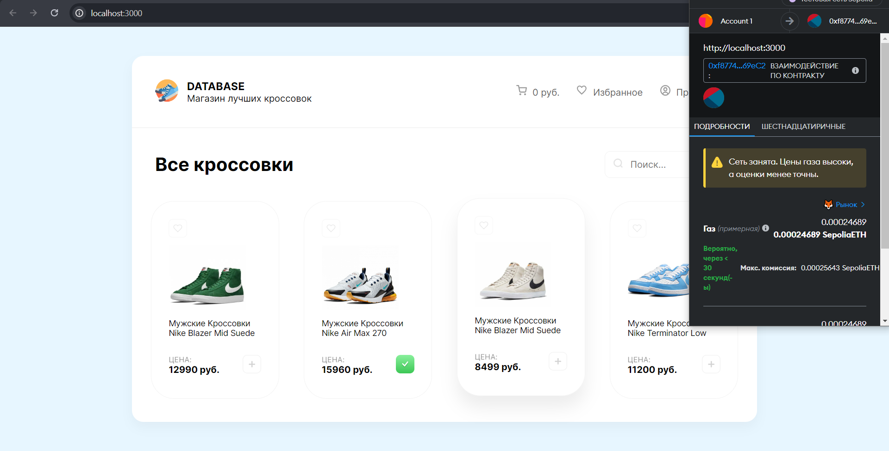
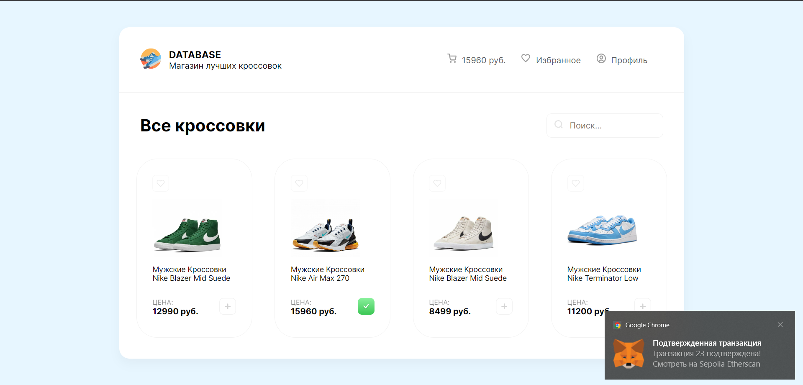
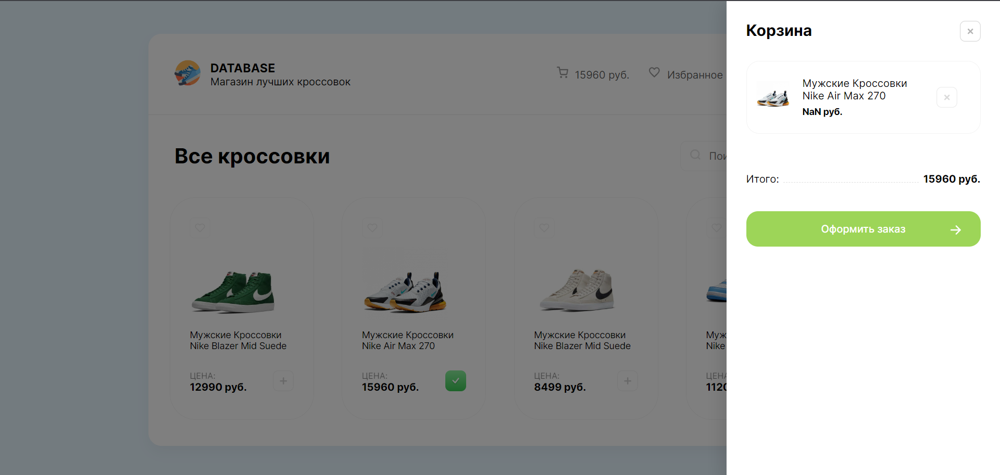
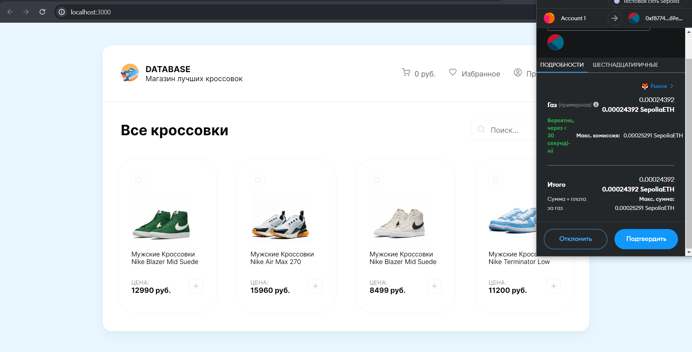
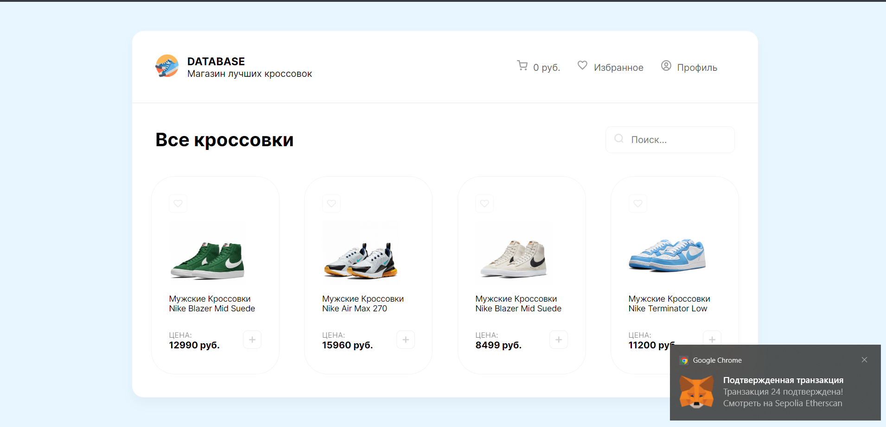
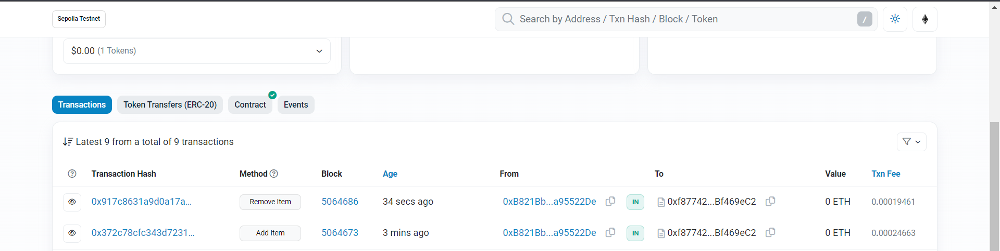

для запуска в консоли вводим npm start и запускаем наше реактовское приложение 

при нажимании кнопки добавить появляется кошелек для подтверждения транзакции 

сообщение о подтверждении транзакции

отображени едобавленного товара в корзине

удаление товара и подтверждение транзакции 

подтвержденная ранзакция 

etherscan
